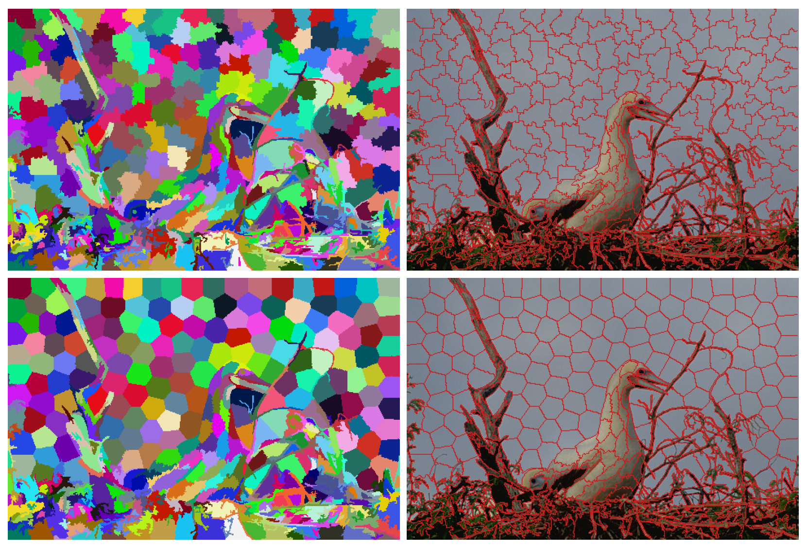

# Superpixel

This program is the implementation of the paper
> **Superpixel Generation by Agglomerative Clustering with Quadratic Error Minimization**
>
> Xiao Dong, 
> Zhonggui Chen, 
> Junfeng Yao,
> Xiaohu Guo
>
> Computer Graphics Forum, 2019

## Configuration:
Set up the corresponding OpenCV include and lib paths for the VS project. 

Parameters:
* in_folder: the folder that contains input images;
* out_folder: the folder that stores the superpixel results, including segmentation images and txt files;
* nSuperpixel: the number of superpixels;
* location_ratio: the parameter that balances the relative importance between color homogeneity and spatial compactness.

Dataset:

You can download [the Berkeley Segmentation Dataset BSDS500](https://www2.eecs.berkeley.edu/Research/Projects/CS/vision/bsds/) from here.

Acknowledgement:
The "merging-swapping" optimization code is built on the basis of source code release by Dr. Michael Garland (http://mgarland.org/papers.html)

## BibTex:
If you find our code or paper useful, please consider citing

	@inproceedings{dong2019superpixel,
	  title={Superpixel generation by agglomerative clustering with quadratic error minimization},
	  author={Dong, Xiao and Chen, Zhonggui and Yao, Junfeng and Guo, Xiaohu},
	  booktitle={Computer Graphics Forum},
	  volume={38},
	  number={1},
	  pages={405--416},
	  year={2019},
	  organization={Wiley Online Library}
	}
	
	@inproceedings{cai2016anisotropic,
	  title={Anisotropic superpixel generation based on mahalanobis distance},
	  author={Cai, Yiqi and Guo, Xiaohu},
	  booktitle={Computer Graphics Forum},
	  volume={35},
	  number={7},
	  pages={199--207},
	  year={2016},
	  organization={Wiley Online Library}
	}
